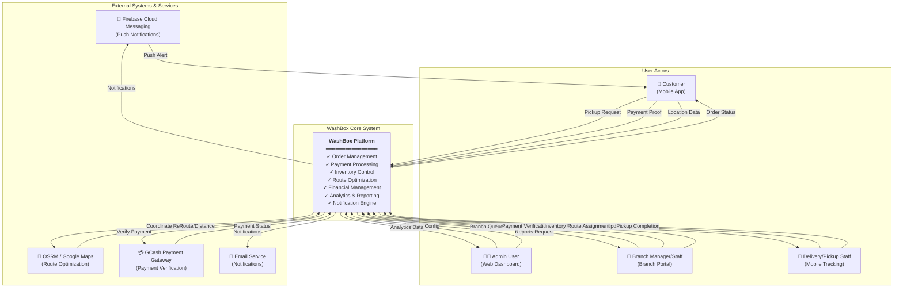
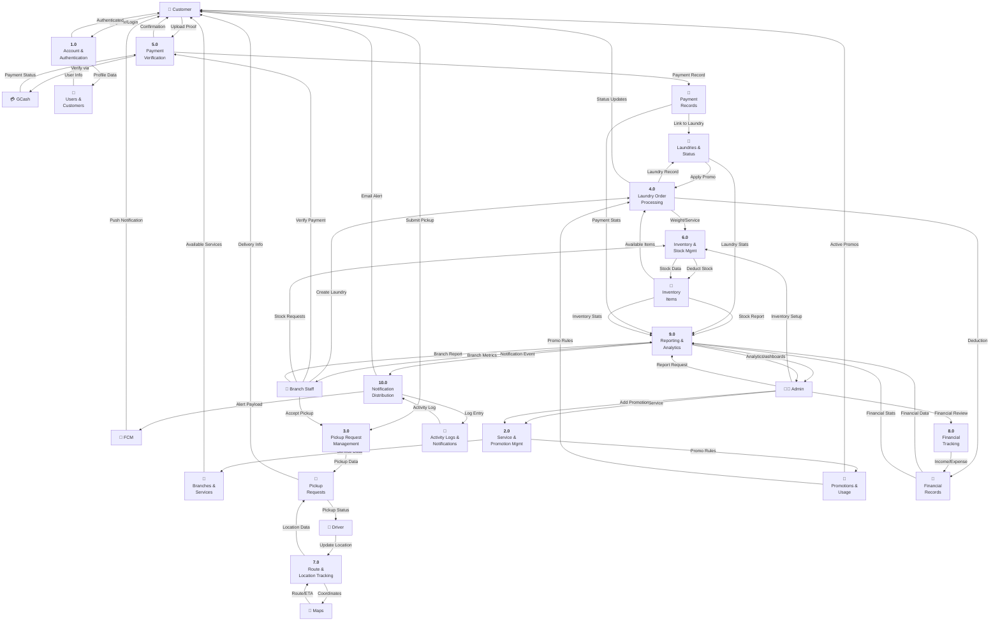
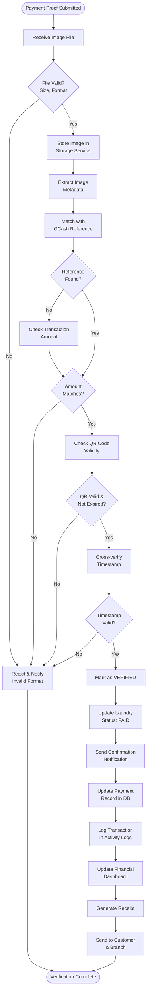
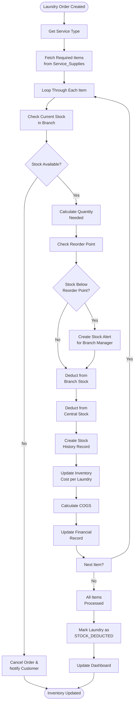
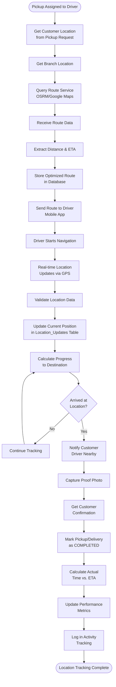
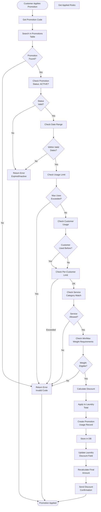
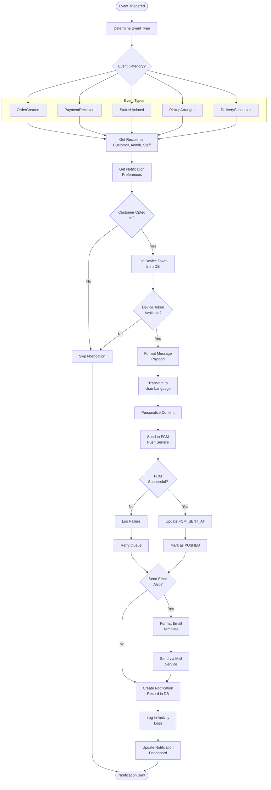

# WashBox System - Architecture Diagrams

**System:** WashBox Laundry Management Platform  
**Version:** 1.0  
**Last Updated:** May 2026  
**Scope:** Complete system architecture with data flows and business processes

---

## Table of Contents

1. [Context Diagram](#1-context-diagram)
2. [Data Flow Diagram (DFD Level 0)](#2-data-flow-diagram-dfd-level-0)
3. [System Flowchart](#3-system-flowchart)
4. [Program Flowchart (Highlights)](#4-program-flowchart-highlights)

---

## 1. Context Diagram

### System Boundary Overview

This diagram shows the WashBox platform at the center, interacting with external systems and user actors. It defines the system boundary and primary data flows.



### Key Interactions:
- **Customers** submit pickup requests, payment proofs, and location data
- **Admin** manages system configuration and requests reports
- **Branch Staff** processes orders, verifies payments, and manages inventory
- **Delivery Staff** receive route assignments and submit location updates
- **External Services** provide push notifications, mapping, payments, and email

---

## 2. Data Flow Diagram (DFD Level 0)

### Process Decomposition

This DFD shows the main processes and data stores, breaking down the system into 10 major functional areas.



### Process Summary:

| ID | Process | Input | Output |
|----|---------| ------|--------|
| 1.0 | Account & Authentication | User credentials | User session |
| 2.0 | Service & Promotion Management | Service details, Promo rules | Service/Promo records |
| 3.0 | Pickup Request Management | Pickup submission | Assigned route |
| 4.0 | Laundry Order Processing | Service type, Weight | Laundry record with pricing |
| 5.0 | Payment Verification | Payment proof | Verified payment |
| 6.0 | Inventory & Stock Management | Stock data, Service requirements | Deducted inventory |
| 7.0 | Route & Location Tracking | Location updates | Optimized routes |
| 8.0 | Financial Tracking | Transaction data | Financial records |
| 9.0 | Reporting & Analytics | Raw data | Dashboards & reports |
| 10.0 | Notification Distribution | Events | Sent notifications |

---

## 3. System Flowchart

### End-to-End Business Process

This comprehensive flowchart shows the complete customer journey from order initiation to completion, including all major decision points and system interactions.

```mermaid
flowchart TD
    START([Customer Initiates Order])
    
    subgraph Auth["Authentication & Setup"]
        A1{Logged In?}
        A2["Customer Registration/<br/>Login via Mobile App"]
        A3["Verify OTP/Email"]
        A4{Success?}
    end

    subgraph Browse["Service Discovery"]
        B1["Browse Services &<br/>View Promotions"]
        B2{Service<br/>Available?}
        B3["View Branch Info &<br/>Pricing"]
    end

    subgraph PickupReq["Pickup Request"]
        P1["Submit Pickup Request"]
        P2["Select Date/Time/Location"]
        P3["Choose Service & Add-ons"]
        P4["Save Request to Database"]
        P5["Notify Admin/Branch Staff"]
        P6{Pickup Accepted<br/>within SLA?}
        P7["Reject & Offer Alternative"]
    end

    subgraph Pickup["Pickup Execution"]
        PU1["Assign Delivery Staff"]
        PU2["Generate Optimized Route"]
        PU3["Send Driver Assignment"]
        PU4["Track Location in Real-time"]
        PU5["Arrive at Customer Location"]
        PU6["Capture Pickup Proof"]
        PU7["Mark as Picked Up"]
    end

    subgraph Laundry["Laundry Processing"]
        L1["Receive at Branch"]
        L2["Weigh & Sort Items"]
        L3["Assign Service Type"]
        L4["Calculate Pricing"]
        L5{Apply Promotion?}
        L6["Deduct Inventory Stock"]
        L7["Create Laundry Record"]
        L8["Update Status: Processing"]
        L9["Process Items"]
        L10["Mark Ready for Delivery"]
    end

    subgraph Payment["Payment Processing"]
        PAY1{Payment Required?}
        PAY2["Generate Invoice"]
        PAY3["Show Payment Methods"]
        PAY4["Customer Uploads<br/>Proof Image"]
        PAY5["Branch Staff<br/>Verifies Proof"]
        PAY6{Valid Proof?}
        PAY7["Notify Customer<br/>to Re-upload"]
        PAY8["Confirm Payment"]
        PAY9["Update Laundry Status: Paid"]
    end

    subgraph Delivery["Delivery/Completion"]
        D1["Prepare Laundry<br/>for Delivery"]
        D2["Assign Delivery Staff"]
        D3["Update Status: Out for Delivery"]
        D4["Track Delivery"]
        D5["Deliver to Customer"]
        D6["Capture Delivery Proof"]
        D7["Get Customer Signature/Confirmation"]
    end

    subgraph Complete["Completion & Follow-up"]
        C1["Mark as Completed"]
        C2["Send Receipt to Customer"]
        C3["Prompt Customer Rating"]
        C4["Update Analytics &<br/>Activity Logs"]
        C5["Generate Financial Record"]
        C6["Update Branch Dashboard"]
    end

    subgraph Notify["Notifications Throughout"]
        N1["Send Pickup Confirmation"]
        N2["Send Status Updates"]
        N3["Send Payment Reminder"]
        N4["Send Delivery Notification"]
        N5["Send Completion Alert"]
    end

    START --> Auth
    Auth --> A1
    A1 -->|No| A2 --> A3 --> A4
    A1 -->|Yes| A4
    A4 -->|Failed| Auth
    A4 -->|Success| Browse
    
    Browse --> B1 --> B2
    B2 -->|No| B1
    B2 -->|Yes| B3 --> PickupReq
    
    PickupReq --> P1 --> P2 --> P3 --> P4 --> P5 --> P6
    P6 -->|No| P7 --> PickupReq
    P6 -->|Yes| Pickup
    
    Pickup --> PU1 --> PU2 --> PU3 --> PU4 --> PU5 --> PU6 --> PU7 --> Laundry
    
    Laundry --> L1 --> L2 --> L3 --> L4 --> L5
    L5 -->|Yes| L6
    L5 -->|No| L7
    L6 --> L7 --> L8 --> L9 --> L10
    
    L10 --> Payment
    Payment --> PAY1
    PAY1 -->|No| PAY9
    PAY1 -->|Yes| PAY2 --> PAY3 --> PAY4 --> PAY5 --> PAY6
    PAY6 -->|Invalid| PAY7 --> PAY4
    PAY6 -->|Valid| PAY8 --> PAY9
    
    PAY9 --> Delivery
    Delivery --> D1 --> D2 --> D3 --> D4 --> D5 --> D6 --> D7
    
    D7 --> Complete
    Complete --> C1 --> C2 --> C3 --> C4 --> C5 --> C6
    
    P1 -.->|Async| Notify
    P5 -.->|Async| Notify
    PAY1 -.->|Async| Notify
    D1 -.->|Async| Notify
    C1 -.->|Async| Notify
    
    C6 --> END([Order Complete])
```



### Key Stages:

1. **Authentication & Setup** - User login/registration
2. **Service Discovery** - Browse available services
3. **Pickup Request** - Schedule pickup with SLA
4. **Pickup Execution** - Real-time tracking and proof capture
5. **Laundry Processing** - Weight, pricing, inventory deduction
6. **Payment Processing** - Proof verification with retry logic
7. **Delivery** - Assignment, tracking, delivery proof
8. **Completion** - Receipt, rating, financial recording

---

## 4. Program Flowchart (Highlights)

### Key Functional Flows

#### 4.1 Payment Verification Process

Detailed flow for handling payment proof uploads with multi-step validation.



---

#### 4.2 Inventory Stock Deduction Flow

Process for managing inventory when a laundry order is created.



---

#### 4.3 Location Tracking & Route Optimization

Real-time GPS tracking and route management for delivery staff.



---

#### 4.4 Promotion Application Logic

Comprehensive validation of promotion codes and discount calculation.



---

#### 4.5 Notification Distribution Pipeline

Multi-channel notification system with preferences and delivery tracking.



---

## System Architecture Summary

### Core Components

| Component | Type | Responsibility |
|-----------|------|-----------------|
| **Mobile App** | Client | Customer pickup requests, payment proofs, location tracking |
| **Admin Dashboard** | Client | System configuration, reports, analytics |
| **Branch Portal** | Client | Order processing, payment verification, inventory management |
| **API Backend** | Server | REST API for all operations, business logic, data management |
| **Database** | Storage | PostgreSQL for persistent data storage |
| **Cache Layer** | Performance | Redis for session management and frequently accessed data |
| **FCM Integration** | External | Push notifications to mobile devices |
| **Payment Gateway** | External | GCash payment verification |
| **Maps Service** | External | Route optimization via OSRM/Google Maps |
| **File Storage** | External | Secure storage for payment proofs and documents |

### Data Flow Summary

```
Customer Mobile App
    ↓
REST API (Laravel)
    ↓
Database (PostgreSQL)
    ↓
Admin/Branch Dashboards
    ↓
Analytics & Reporting
    ↓
Notifications via FCM/Email
```

### Key Integration Points

1. **FCM** - Push notifications for order updates
2. **GCash** - Payment verification and confirmation
3. **OSRM/Google Maps** - Route optimization and ETA calculation
4. **Email Service** - Transactional and promotional emails
5. **File Storage** - Secure proof image storage

---

## Data Stores

### Master Data
- Users, Customers, Branches, Services, Categories

### Transactional Data
- PickupRequests, Laundries, Payments, Promotions

### Operational Data
- LocationUpdates, InventoryItems, BranchStocks, PaymentProofs

### Analytical Data
- FinancialTransactions, ActivityLogs, Reports, Analytics

---

**End of Architecture Diagrams Document**
