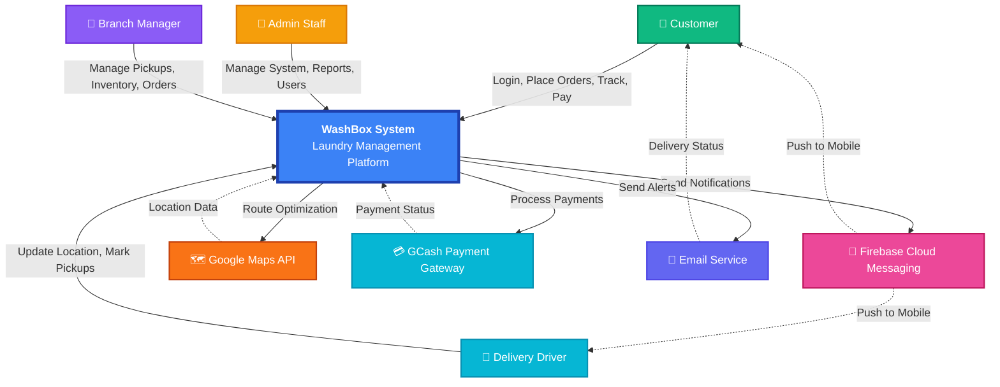

# Context Diagram - WashBox System

## Visual Context Diagram (System Boundary)

## Key Interactions

| Actor | System Interface | Primary Functions |
|-------|-----------------|-------------------|
| **Customer** | Mobile App | Browse services, request pickups, pay, track orders |
| **Admin Staff** | Web Dashboard | System management, user control, reports |
| **Branch Manager** | Web Dashboard | Inventory, order processing, staff management |
| **Delivery Driver** | Mobile App | Real-time tracking, pickup confirmation, location updates |

## External Services

| Service | Purpose | Data Exchange |
|---------|---------|----------------|
| **Firebase** | Push notifications | Token registration, notification payload |
| **Google Maps** | Location & routing | GPS coordinates, route optimization |
| **GCash** | Payment processing | Transaction ID, payment status |
| **Email** | Notifications | Alerts, receipts, status updates |

## System Scope

- **In Scope**: Customer registration, order management, pickup scheduling, inventory tracking, payment verification, delivery management
- **Out of Scope**: Actual cash handling, laundry processing machines, physical logistics

---

**Note**: This context diagram shows the WashBox system as a black box with external actors and services interacting at the boundaries.
