# Data Flow Diagram Level 0 - WashBox System

## DFD Level 0 (High-Level Processes)

```mermaid
graph LR
    Customer["👤 Customer"]
    Admin["🔑 Admin"]
    Branch["🏪 Branch"]
    Driver["🚗 Driver"]
    
    P1["<b>P1</b><br/>Authentication<br/>& Auth"]
    P2["<b>P2</b><br/>Service &<br/>Promotion Mgmt"]
    P3["<b>P3</b><br/>Pickup<br/>Request Mgmt"]
    P4["<b>P4</b><br/>Laundry Order<br/>Processing"]
    P5["<b>P5</b><br/>Payment<br/>Verification"]
    P6["<b>P6</b><br/>Inventory<br/>Management"]
    P7["<b>P7</b><br/>Location<br/>Tracking"]
    P8["<b>P8</b><br/>Financial<br/>Tracking"]
    P9["<b>P9</b><br/>Reporting &<br/>Analytics"]
    P10["<b>P10</b><br/>Notification<br/>Distribution"]
    
    D1["📊 Customer Data"]
    D2["📊 Service Catalog"]
    D3["📊 Pickup Requests"]
    D4["📊 Laundry Orders"]
    D5["📊 Payment Records"]
    D6["📊 Inventory Stock"]
    D7["📊 Location Trail"]
    D8["📊 Financial Data"]
    D9["📊 Notification Logs"]
    
    Customer -->|1: Login, Register| P1
    Admin -->|2: Manage Services| P2
    Customer -->|3: Request Pickup| P3
    Customer -->|4: Place Order| P4
    Customer -->|5: Submit Payment| P5
    Branch -->|6: Update Inventory| P6
    Driver -->|7: Send Location| P7
    Admin -->|8: View Financials| P8
    Admin -->|9: Request Report| P9
    P10 -->|Notify| Customer
    P10 -->|Notify| Branch
    P10 -->|Notify| Driver
    
    P1 --> D1
    P2 --> D2
    P3 --> D3
    P4 --> D4
    P5 --> D5
    P6 --> D6
    P7 --> D7
    P8 --> D8
    P10 --> D9
    
    D1 --> P2
    D2 --> P4
    D3 --> P4
    D4 --> P5
    D5 --> P8
    D6 --> P6
    D7 --> P7
    D8 --> P9
    
    style P1 fill:#3b82f6,color:#fff,stroke:#1e40af,stroke-width:2px
    style P2 fill:#3b82f6,color:#fff,stroke:#1e40af,stroke-width:2px
    style P3 fill:#3b82f6,color:#fff,stroke:#1e40af,stroke-width:2px
    style P4 fill:#3b82f6,color:#fff,stroke:#1e40af,stroke-width:2px
    style P5 fill:#3b82f6,color:#fff,stroke:#1e40af,stroke-width:2px
    style P6 fill:#3b82f6,color:#fff,stroke:#1e40af,stroke-width:2px
    style P7 fill:#3b82f6,color:#fff,stroke:#1e40af,stroke-width:2px
    style P8 fill:#3b82f6,color:#fff,stroke:#1e40af,stroke-width:2px
    style P9 fill:#3b82f6,color:#fff,stroke:#1e40af,stroke-width:2px
    style P10 fill:#ec4899,color:#fff,stroke:#be185d,stroke-width:2px
    
    style D1 fill:#10b981,color:#fff,stroke:#047857,stroke-width:2px
    style D2 fill:#10b981,color:#fff,stroke:#047857,stroke-width:2px
    style D3 fill:#10b981,color:#fff,stroke:#047857,stroke-width:2px
    style D4 fill:#10b981,color:#fff,stroke:#047857,stroke-width:2px
    style D5 fill:#10b981,color:#fff,stroke:#047857,stroke-width:2px
    style D6 fill:#10b981,color:#fff,stroke:#047857,stroke-width:2px
    style D7 fill:#10b981,color:#fff,stroke:#047857,stroke-width:2px
    style D8 fill:#10b981,color:#fff,stroke:#047857,stroke-width:2px
    style D9 fill:#10b981,color:#fff,stroke:#047857,stroke-width:2px
```

## Process Descriptions

| Process | Input Data | Processing | Output Data |
|---------|-----------|-----------|------------|
| **P1: Authentication** | Credentials | Login validation, token generation | Auth tokens, user session |
| **P2: Service Mgmt** | Service details | CRUD operations, pricing logic | Service catalog, promotions |
| **P3: Pickup Mgmt** | Location, date, items | Validation, scheduling | Pickup requests, schedules |
| **P4: Order Processing** | Service selection, items | Calculation, inventory deduction | Laundry orders, receipts |
| **P5: Payment Verification** | Payment proof, QR scan | Amount validation, status update | Payment records, confirmation |
| **P6: Inventory** | Stock counts, usage | Level tracking, reorder logic | Stock reports, alerts |
| **P7: Location Tracking** | GPS coordinates, timestamp | Route optimization, storage | Location trails, analytics |
| **P8: Financial Tracking** | Transactions, payments | Aggregation, reporting | Financial reports, KPIs |
| **P9: Reports & Analytics** | System data | Analysis, visualization | Admin dashboards, reports |
| **P10: Notifications** | Events, user data | Message formatting, channel selection | Push/Email notifications |

## Data Stores

| Store | Data Type | Purpose |
|-------|-----------|---------|
| **D1: Customer Data** | User profiles, credentials, addresses | Authentication, customer management |
| **D2: Service Catalog** | Services, pricing, promotions | Service discovery, order creation |
| **D3: Pickup Requests** | Schedules, locations, status | Pickup management and tracking |
| **D4: Laundry Orders** | Order details, items, pricing | Order lifecycle management |
| **D5: Payment Records** | Transactions, proofs, status | Payment verification and auditing |
| **D6: Inventory Stock** | Item quantities, reorder points | Stock management and alerts |
| **D7: Location Trail** | GPS logs, timestamps, routes | Real-time tracking and analytics |
| **D8: Financial Data** | Revenue, expenses, settlements | Financial reporting and analysis |
| **D9: Notification Logs** | Sent messages, delivery status | Audit trail for communications |

---

**Note**: This DFD Level 0 shows the main processes and their data flows. Each process can be further decomposed into Level 1 DFDs.
