# System Flowchart - WashBox Customer Journey

## Complete System Flow (End-to-End)

```mermaid
graph TD
    Start([👤 Customer Opens App])
    
    Login{User<br/>Logged In?}
    Register["📝 Registration<br/>- Email/Phone<br/>- Password<br/>- Address"]
    SignIn["🔐 Sign In<br/>- Verify Credentials<br/>- Generate Token"]
    
    Dashboard["📲 Home Dashboard<br/>- Active Orders<br/>- Pickup Status<br/>- Promotions"]
    
    Browse{User<br/>Action?}
    
    A1["🛒 Browse Services"]
    A2["📍 Request Pickup"]
    A3["💳 Pay Order"]
    A4["📍 Track Order"]
    
    ServiceSelect["🎯 Select Service<br/>- Choose Service<br/>- Add Items<br/>- Calculate Price"]
    
    PickupReq["📅 Pickup Request<br/>- Choose Date/Time<br/>- Confirm Address<br/>- Submit Request"]
    
    PaymentScreen["💰 Payment Screen<br/>- Display Amount<br/>- Show Methods<br/>- GCash/Cash"]
    
    Payment{Payment<br/>Method?}
    
    GCashPay["🏦 GCash Payment<br/>- Take Screenshot<br/>- Submit Proof<br/>- Await Approval"]
    CashPay["💵 Cash Payment<br/>- Pay at Pickup<br/>- Get Receipt"]
    
    PaymentWait["⏳ Awaiting Verification<br/>- QR Code Check<br/>- Amount Verification<br/>- Admin Approval"]
    
    PaymentApproved{Payment<br/>Approved?}
    
    PaymentRejected["❌ Payment Rejected<br/>- Notify Customer<br/>- Suggest Retry"]
    
    OrderConfirmed["✅ Order Confirmed<br/>- Generate Tracking#<br/>- Send Notification<br/>- Schedule Pickup"]
    
    Pickup["🚗 Pickup Execution<br/>- Driver Arrives<br/>- Collect Items<br/>- Take Photo<br/>- Mark Complete"]
    
    Processing["🏭 Laundry Processing<br/>- Queue at Branch<br/>- Process Service<br/>- Quality Check<br/>- Package Items"]
    
    Ready["📦 Ready for Delivery<br/>- Notify Customer<br/>- Prepare for Delivery<br/>- Generate Receipt"]
    
    Delivery["🚚 Delivery<br/>- Driver Picks Up<br/>- Route Optimization<br/>- Real-time Tracking<br/>- Deliver to Customer"]
    
    Complete["🎉 Completed<br/>- Confirm Delivery<br/>- Update Status<br/>- Send Receipt<br/>- Request Rating"]
    
    RatingReview["⭐ Rating & Review<br/>- Rate Service<br/>- Provide Feedback<br/>- Save for Analytics"]
    
    End([✨ Transaction Complete])
    
    Notify1["📱 Notification: Order Confirmed"]
    Notify2["📱 Notification: Ready for Delivery"]
    Notify3["📱 Notification: Out for Delivery"]
    Notify4["📱 Notification: Delivered"]
    
    Start --> Login
    Login -->|No| Register
    Register --> SignIn
    Login -->|Yes| Dashboard
    SignIn --> Dashboard
    
    Dashboard --> Browse
    Browse -->|Browse| A1
    Browse -->|Pickup| A2
    Browse -->|Payment| A3
    Browse -->|Track| A4
    
    A1 --> ServiceSelect
    ServiceSelect --> Dashboard
    
    A2 --> PickupReq
    PickupReq --> Dashboard
    
    A3 --> PaymentScreen
    PaymentScreen --> Payment
    
    Payment -->|GCash| GCashPay
    Payment -->|Cash| CashPay
    
    GCashPay --> PaymentWait
    CashPay --> OrderConfirmed
    
    PaymentWait --> PaymentApproved
    PaymentApproved -->|No| PaymentRejected
    PaymentRejected --> PaymentScreen
    PaymentApproved -->|Yes| OrderConfirmed
    
    OrderConfirmed --> Notify1
    Notify1 --> Pickup
    
    Pickup --> Processing
    Processing --> Ready
    Ready --> Notify2
    
    Notify2 --> Delivery
    Delivery --> Notify3
    Notify3 --> Complete
    Complete --> Notify4
    
    Notify4 --> RatingReview
    RatingReview --> End
    
    A4 --> Complete
    
    style Start fill:#10b981,stroke:#047857,stroke-width:2px,color:#fff
    style End fill:#10b981,stroke:#047857,stroke-width:2px,color:#fff
    style Login fill:#3b82f6,stroke:#1e40af,stroke-width:2px,color:#fff
    style Register fill:#3b82f6,stroke:#1e40af,stroke-width:2px,color:#fff
    style SignIn fill:#3b82f6,stroke:#1e40af,stroke-width:2px,color:#fff
    style Dashboard fill:#8b5cf6,stroke:#6d28d9,stroke-width:2px,color:#fff
    style Browse fill:#f59e0b,stroke:#d97706,stroke-width:2px,color:#fff
    style PaymentWait fill:#f97316,stroke:#c2410c,stroke-width:2px,color:#fff
    style PaymentApproved fill:#f59e0b,stroke:#d97706,stroke-width:2px,color:#fff
    style PaymentRejected fill:#ef4444,stroke:#991b1b,stroke-width:2px,color:#fff
    style OrderConfirmed fill:#10b981,stroke:#047857,stroke-width:2px,color:#fff
    style Complete fill:#10b981,stroke:#047857,stroke-width:2px,color:#fff
    style Notify1 fill:#ec4899,stroke:#be185d,stroke-width:2px,color:#fff
    style Notify2 fill:#ec4899,stroke:#be185d,stroke-width:2px,color:#fff
    style Notify3 fill:#ec4899,stroke:#be185d,stroke-width:2px,color:#fff
    style Notify4 fill:#ec4899,stroke:#be185d,stroke-width:2px,color:#fff
```

## System Stages

| Stage | Duration | Key Activities | Notifications |
|-------|----------|---|---|
| **Authentication** | < 1 min | Login/Register, token generation | - |
| **Service Discovery** | Variable | Browse services, view pricing, apply promotions | - |
| **Pickup Request** | 5-30 min | Schedule pickup, confirm address | Confirmation SMS/Push |
| **Pickup Execution** | 10-30 min | Driver collects items, takes photo | Pickup started notification |
| **Processing** | 24-48 hrs | Laundry service execution, quality check | Status updates |
| **Ready for Delivery** | 1-2 hrs | Package items, generate receipt | Ready notification |
| **Delivery** | 30 min - 2 hrs | Driver route optimization, real-time tracking | Delivery started, En route, Delivered |
| **Completion** | < 1 min | Delivery confirmation, rating request | Delivery complete |

## Decision Points

1. **User Logged In?** → Directs to login/register or dashboard
2. **Payment Method?** → GCash (verification) or Cash (immediate)
3. **Payment Approved?** → Confirm order or retry payment
4. **User Action?** → Browse, Pickup, Payment, or Track

---

**Note**: This flowchart shows the happy path with async notifications throughout. Error paths and alternative flows can be detailed separately.
