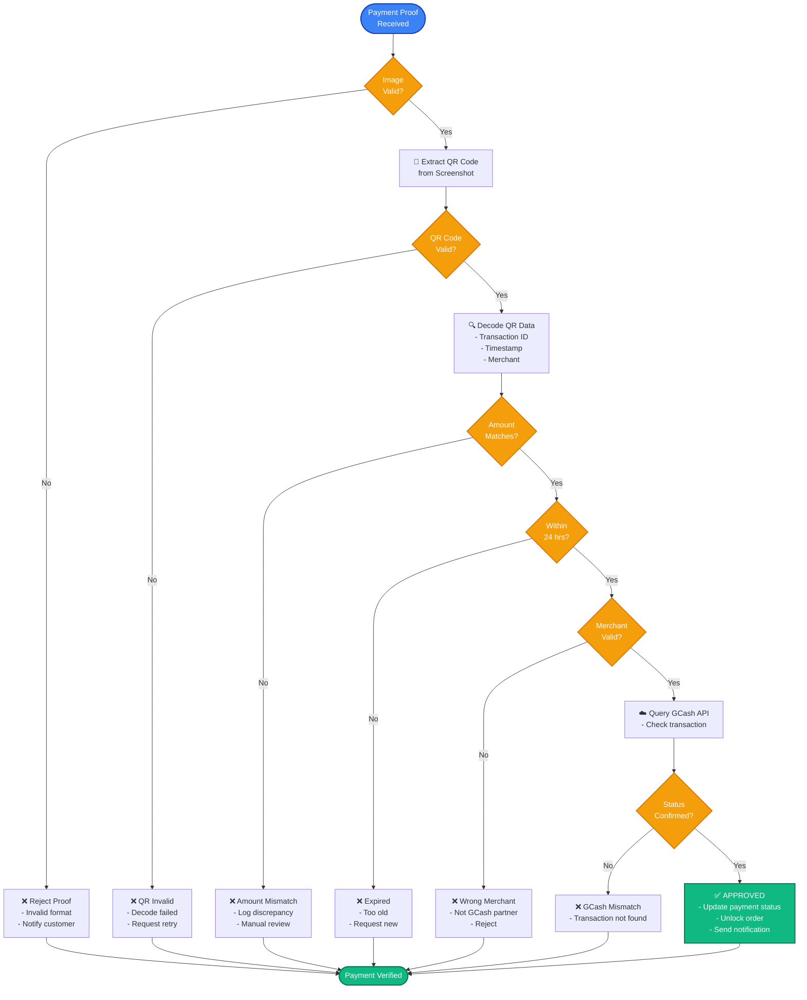
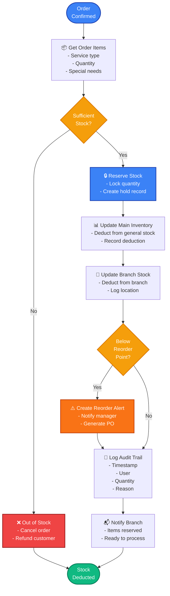
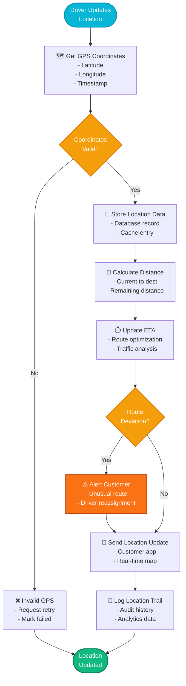
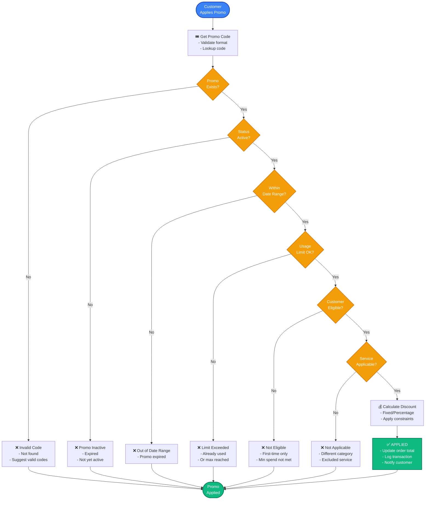

# Program Flowchart - Critical Functional Flows

## 1. Payment Verification Flow

## 2. Inventory Stock Deduction Flow

## 3. Location Tracking & Route Optimization

## 4. Promotion Application & Validation

## 5. Notification Distribution Flow

```mermaid
graph TD
    Start5([Event<br/>Triggered])
    
    GetEvent["📌 Identify Event Type<br/>- Order confirmed<br/>- Payment received<br/>- Ready for delivery<br/>- etc."]
    
    GetRecipients["👥 Get Recipients<br/>- Customer ID<br/>- Driver ID<br/>- Branch staff<br/>- Admin alerts"]
    
    GetDevices["📱 Get Device Tokens<br/>- Active tokens<br/>- Preferred channels<br/>- Language"]
    
    FormatMsg["✍️ Format Message<br/>- Localization<br/>- Personalization<br/>- Variables inject"]
    
    ForEachDevice{For Each<br/>Device<br/>Token}
    
    SendFCM["🔔 Send via FCM<br/>- Queue message<br/>- Set priority<br/>- Add retry"]
    
    FCMSuccess{Sent<br/>OK?}
    FCMFail["⚠️ FCM Failed<br/>- Log error<br/>- Queue for retry"]
    
    SendEmail{Send Email<br/>Too?}
    EmailSend["📧 Send Email<br/>- Format HTML<br/>- Queue SMTP<br/>- Track delivery"]
    
    LogEvent["📝 Log Delivery<br/>- Timestamp<br/>- Status<br/>- Channel<br/>- Recipient"]
    
    LoopEnd{All<br/>Devices<br/>Done?}
    
    SendDLR["📊 Send DLR<br/>- Delivery receipt<br/>- Success count<br/>- Failures"]
    
    End5([Notifications<br/>Sent])
    
    Start5 --> GetEvent
    GetEvent --> GetRecipients
    GetRecipients --> GetDevices
    GetDevices --> FormatMsg
    
    FormatMsg --> ForEachDevice
    ForEachDevice -->|Yes| SendFCM
    
    SendFCM --> FCMSuccess
    FCMSuccess -->|No| FCMFail
    FCMSuccess -->|Yes| SendEmail
    
    FCMFail --> LogEvent
    SendEmail -->|Yes| EmailSend
    SendEmail -->|No| LogEvent
    
    EmailSend --> LogEvent
    LogEvent --> LoopEnd
    
    LoopEnd -->|No| ForEachDevice
    LoopEnd -->|Yes| SendDLR
    SendDLR --> End5
    
    style Start5 fill:#ec4899,stroke:#be185d,stroke-width:2px,color:#fff
    style End5 fill:#10b981,stroke:#047857,stroke-width:2px,color:#fff
    style SendFCM fill:#06b6d4,stroke:#0891b2,stroke-width:2px,color:#fff
    style EmailSend fill:#6366f1,stroke:#4f46e5,stroke-width:2px,color:#fff
    style ForEachDevice fill:#f59e0b,stroke:#d97706,stroke-width:2px,color:#fff
    style LoopEnd fill:#f59e0b,stroke:#d97706,stroke-width:2px,color:#fff
    style FCMSuccess fill:#f59e0b,stroke:#d97706,stroke-width:2px,color:#fff
    style SendEmail fill:#f59e0b,stroke:#d97706,stroke-width:2px,color:#fff
```

---

## Summary

| Flow | Purpose | Key Validations | Success Criteria |
|------|---------|-----------------|-----------------|
| **Payment Verification** | Validate payment proof accuracy | Image quality, QR code, amount, timestamp, merchant | Payment approved & order unlocked |
| **Inventory Management** | Track and manage stock levels | Stock availability, reorder points | Items reserved & branch notified |
| **Location Tracking** | Real-time driver tracking | GPS validity, route optimization | Location updated & customer notified |
| **Promotion Validation** | Apply discounts correctly | Code validity, eligibility, usage limits | Discount calculated & applied |
| **Notification Distribution** | Deliver messages across channels | Device availability, message formatting | All recipients notified via FCM/Email |

**Note**: These program flows show critical business logic with decision branches, error handling, and async operations.
