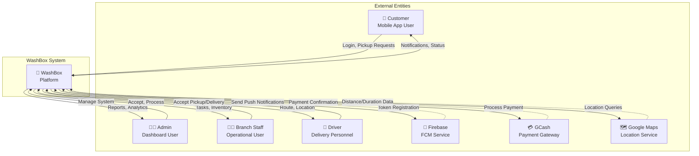
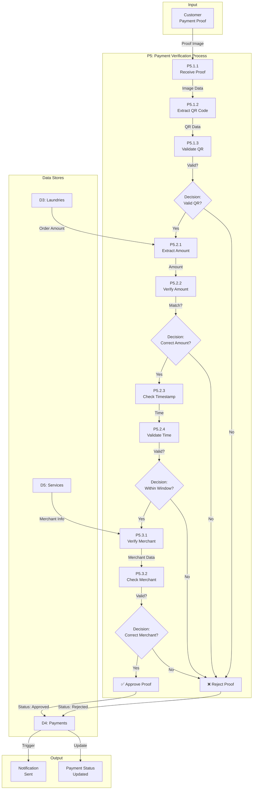
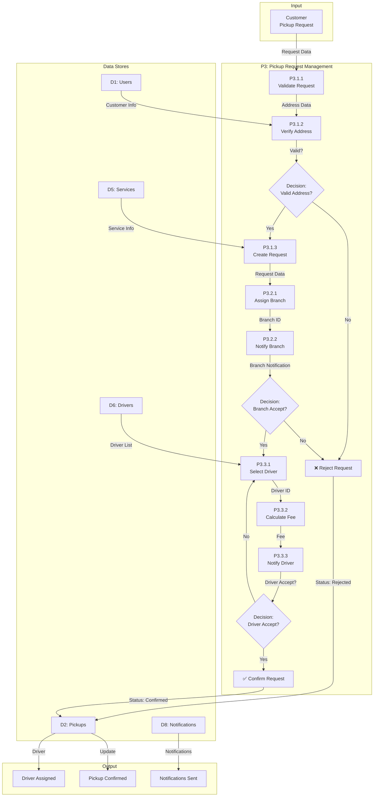
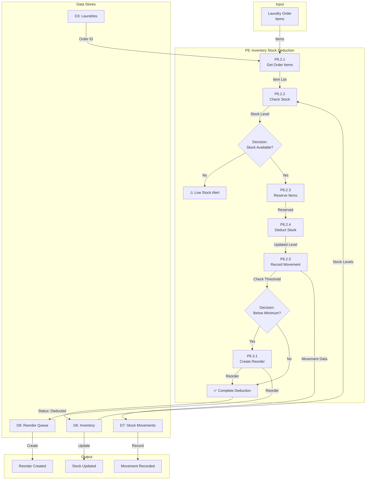

# WashBox - Detailed Data Flow Diagram (Level 0 & Level 1)

## Level 0 - System Context Data Flow

---

## Level 1 - Detailed Process Decomposition

```mermaid
graph TB
    subgraph External["External Entities"]
        Customer["👤 Customer"]
        Admin["👨‍💼 Admin"]
        BranchStaff["👨‍💼 Branch"]
        Driver["🚗 Driver"]
        Firebase["🔔 Firebase"]
        GCash["💳 GCash"]
        Maps["🗺️ Maps"]
    end
    
    subgraph ProcessAuth["P1: Authentication & Account Management"]
        P1A["P1.1 User Registration"]
        P1B["P1.2 Login/Logout"]
        P1C["P1.3 Profile Management"]
    end
    
    subgraph ProcessService["P2: Service & Promotion Management"]
        P2A["P2.1 Manage Services"]
        P2B["P2.2 Manage Promotions"]
        P2C["P2.3 Apply Discounts"]
    end
    
    subgraph ProcessPickup["P3: Pickup Request Management"]
        P3A["P3.1 Create Pickup Request"]
        P3B["P3.2 Manage Pickup Status"]
        P3C["P3.3 Assign to Driver"]
    end
    
    subgraph ProcessLaundry["P4: Laundry Order Processing"]
        P4A["P4.1 Create Laundry Order"]
        P4B["P4.2 Track Laundry Status"]
        P4C["P4.3 Update Progress"]
    end
    
    subgraph ProcessPayment["P5: Payment Verification"]
        P5A["P5.1 Submit Payment Proof"]
        P5B["P5.2 Verify Payment"]
        P5C["P5.3 Update Payment Status"]
    end
    
    subgraph ProcessInventory["P6: Inventory Management"]
        P6A["P6.1 Track Stock Levels"]
        P6B["P6.2 Process Deductions"]
        P6C["P6.3 Reorder Management"]
    end
    
    subgraph ProcessTracking["P7: Location & Route Tracking"]
        P7A["P7.1 Real-time GPS Tracking"]
        P7B["P7.2 Route Optimization"]
        P7C["P7.3 ETA Calculation"]
    end
    
    subgraph ProcessNotification["P8: Notification Distribution"]
        P8A["P8.1 Queue Notifications"]
        P8B["P8.2 Send via FCM"]
        P8C["P8.3 Track Delivery"]
    end
    
    subgraph ProcessAnalytics["P9: Reporting & Analytics"]
        P9A["P9.1 Generate Reports"]
        P9B["P9.2 Analytics Processing"]
        P9C["P9.3 Dashboard Updates"]
    end
    
    subgraph DataStores["Data Stores"]
        D1["D1: Users"]
        D2["D2: Pickups"]
        D3["D3: Laundries"]
        D4["D4: Payments"]
        D5["D5: Services"]
        D6["D6: Inventory"]
        D7["D7: Notifications"]
        D8["D8: DeviceTokens"]
        D9["D9: Transactions"]
    end
    
    %% Authentication Flows
    Customer -->|Login Credentials| P1B
    P1B -->|Authentication| D1
    D1 -->|Token| P1B
    P1B -->|Auth Status| Customer
    
    %% Pickup Flows
    Customer -->|Request Pickup| P3A
    P3A -->|Create Request| D2
    D2 -->|Pickup Data| P3B
    P3B -->|Accept/Reject| BranchStaff
    BranchStaff -->|Assign Driver| P3C
    P3C -->|Update Status| D2
    D2 -->|Notification Event| P8A
    
    %% Service & Promotion
    Admin -->|Manage| P2A
    P2A -->|Store| D5
    D5 -->|Available Services| Customer
    Customer -->|Browse Services| P2B
    P2B -->|Check Eligibility| P2C
    P2C -->|Apply Discount| D5
    
    %% Laundry Order
    P3A -->|Create Order| P4A
    P4A -->|Store Order| D3
    D3 -->|Order Status| P4B
    BranchStaff -->|Update Process| P4C
    P4C -->|Status Change| D3
    
    %% Payment Processing
    Customer -->|Submit Proof| P5A
    P5A -->|Verify Details| P5B
    P5B -->|Check QR/Amount| GCash
    GCash -->|Payment Status| P5B
    P5B -->|Update Status| D4
    D4 -->|Payment Confirmation| P5C
    P5C -->|Record Transaction| D9
    
    %% Inventory Management
    BranchStaff -->|Request Stock| P6A
    P6A -->|Check Levels| D6
    D6 -->|Stock Data| P6B
    P4C -->|Deduct Items| P6B
    P6B -->|Update Stock| D6
    D6 -->|Low Stock Alert| P6C
    P6C -->|Reorder Notification| Admin
    
    %% Location Tracking
    Driver -->|GPS Data| P7A
    P7A -->|Real-time Update| D2
    D2 -->|Track Status| Maps
    Maps -->|Distance Data| P7B
    P7B -->|Optimized Route| D2
    Maps -->|ETA Data| P7C
    P7C -->|Update ETA| P8A
    
    %% Notifications
    D2 -->|Status Change| P8A
    D3 -->|Order Update| P8A
    D4 -->|Payment Update| P8A
    P8A -->|Queue Event| D7
    D7 -->|Get Token| D8
    D8 -->|Device Token| P8B
    P8B -->|Send Notification| Firebase
    Firebase -->|Push Message| Customer
    P8C -->|Delivery Status| D7
    
    %% Analytics & Reporting
    D1 -->|User Data| P9A
    D2 -->|Pickup Data| P9A
    D3 -->|Laundry Data| P9A
    D4 -->|Payment Data| P9A
    D9 -->|Transaction Data| P9A
    P9A -->|Generate Reports| P9B
    P9B -->|Process Analytics| P9C
    P9C -->|Dashboard Data| Admin

```

---

## Level 2 - Payment Verification Process Detail

---

## Level 2 - Pickup Request Management Detail

---

## Level 2 - Inventory Stock Deduction Detail

---

## Data Store Dictionary

| ID | Store Name | Primary Data | Access Frequency |
|----|-----------|--------------|------------------|
| D1 | Users | Customer, Admin, Driver profiles | Very High |
| D2 | Pickups | Pickup requests, status, assignments | High |
| D3 | Laundries | Order details, items, status | High |
| D4 | Payments | Payment proofs, status, verification | High |
| D5 | Services | Service definitions, pricing, promos | Medium |
| D6 | Inventory | Stock levels, movements, reorders | High |
| D7 | Notifications | Notification queue, delivery status | Very High |
| D8 | DeviceTokens | FCM tokens, device info | Medium |
| D9 | Transactions | Financial records, audit trail | Medium |

---

## Data Flow Summary

### Primary Data Flows
1. **Authentication Flow** - Login credentials → User validation → Auth token
2. **Pickup Flow** - Request → Validation → Assignment → Confirmation
3. **Payment Flow** - Proof submission → Verification → Approval → Notification
4. **Inventory Flow** - Order items → Stock check → Deduction → Movement record
5. **Notification Flow** - Event trigger → Queue → Token retrieval → FCM send
6. **Tracking Flow** - GPS data → Route optimization → ETA update → Status change

### Data Volume Estimates (Daily)
- **Pickups:** 2,000 requests/day
- **Laundries:** 8,000 orders/day
- **Payments:** 4,000 proofs/day
- **Notifications:** 50,000 messages/day
- **Location Updates:** 100,000 GPS points/day

### Critical Data Paths
- Payment verification (< 5 second response)
- Pickup assignment (< 30 second response)
- Real-time tracking (< 2 second update)
- Inventory deduction (atomic, no partial updates)
