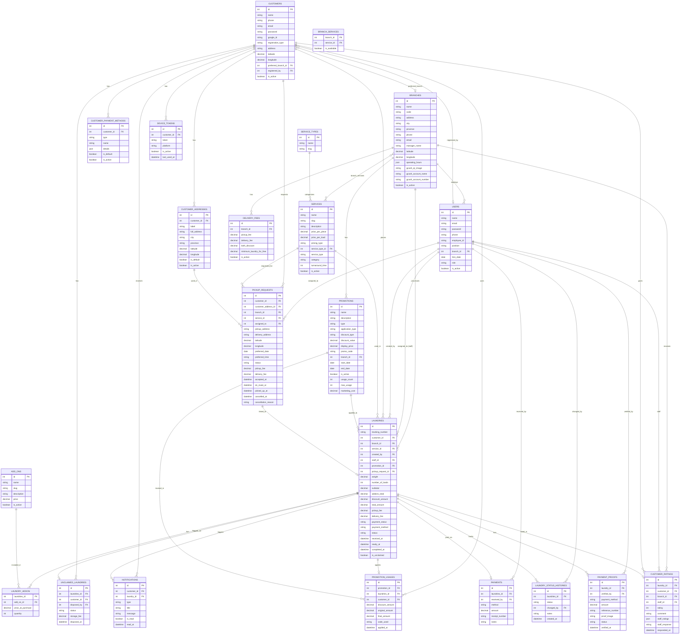

# WashBox — Entity Relationship Diagram

```mermaid
erDiagram

    BRANCHES {
        int id PK
        string name
        string code
        string address
        string city
        string province
        string phone
        string email
        string manager_name
        decimal latitude
        decimal longitude
        json operating_hours
        string gcash_qr_image
        string gcash_account_name
        string gcash_account_number
        boolean is_active
    }

    USERS {
        int id PK
        string name
        string email
        string password
        string phone
        string employee_id
        string position
        int branch_id FK
        date hire_date
        string role
        boolean is_active
    }

    CUSTOMERS {
        int id PK
        string name
        string phone
        string email
        string password
        string google_id
        string registration_type
        string address
        decimal latitude
        decimal longitude
        int preferred_branch_id FK
        int registered_by FK
        boolean is_active
    }

    CUSTOMER_ADDRESSES {
        int id PK
        int customer_id FK
        string label
        string full_address
        string city
        string province
        decimal latitude
        decimal longitude
        boolean is_default
        boolean is_active
    }

    CUSTOMER_PAYMENT_METHODS {
        int id PK
        int customer_id FK
        string type
        string name
        json details
        boolean is_default
        boolean is_active
    }

    SERVICE_TYPES {
        int id PK
        string name
        string slug
    }

    SERVICES {
        int id PK
        string name
        string slug
        string description
        decimal price_per_piece
        decimal price_per_load
        string pricing_type
        int service_type_id FK
        string service_type
        string category
        int turnaround_time
        boolean is_active
    }

    ADD_ONS {
        int id PK
        string name
        string slug
        string description
        decimal price
        boolean is_active
    }

    PROMOTIONS {
        int id PK
        string name
        string description
        string type
        string application_type
        string discount_type
        decimal discount_value
        decimal display_price
        string promo_code
        int branch_id FK
        date start_date
        date end_date
        boolean is_active
        int usage_count
        int max_usage
        decimal marketing_cost
    }

    PICKUP_REQUESTS {
        int id PK
        int customer_id FK
        int customer_address_id FK
        int branch_id FK
        int service_id FK
        int assigned_to FK
        string pickup_address
        string delivery_address
        decimal latitude
        decimal longitude
        date preferred_date
        string preferred_time
        string status
        decimal pickup_fee
        decimal delivery_fee
        datetime accepted_at
        datetime en_route_at
        datetime picked_up_at
        datetime cancelled_at
        string cancellation_reason
    }

    LAUNDRIES {
        int id PK
        string tracking_number
        int customer_id FK
        int branch_id FK
        int service_id FK
        int created_by FK
        int staff_id FK
        int promotion_id FK
        int pickup_request_id FK
        decimal weight
        int number_of_loads
        decimal subtotal
        decimal addons_total
        decimal discount_amount
        decimal total_amount
        decimal pickup_fee
        decimal delivery_fee
        string payment_status
        string payment_method
        string status
        datetime received_at
        datetime ready_at
        datetime completed_at
        boolean is_unclaimed
    }

    LAUNDRY_ADDON {
        int laundries_id FK
        int add_on_id FK
        decimal price_at_purchase
        int quantity
    }

    LAUNDRY_STATUS_HISTORIES {
        int id PK
        int laundries_id FK
        string status
        int changed_by FK
        string notes
        datetime created_at
    }

    PAYMENTS {
        int id PK
        int laundries_id FK
        int received_by FK
        string method
        decimal amount
        string receipt_number
        string notes
    }

    PAYMENT_PROOFS {
        int id PK
        int laundry_id FK
        int verified_by FK
        string payment_method
        decimal amount
        string reference_number
        string proof_image
        string status
        datetime verified_at
    }

    PROMOTION_USAGES {
        int id PK
        int promotion_id FK
        int laundries_id FK
        int customer_id FK
        decimal discount_amount
        decimal original_amount
        decimal final_amount
        string code_used
        datetime applied_at
    }

    CUSTOMER_RATINGS {
        int id PK
        int laundry_id FK
        int customer_id FK
        int branch_id FK
        int staff_id FK
        int rating
        string comment
        json staff_ratings
        string staff_response
        datetime responded_at
    }

    UNCLAIMED_LAUNDRIES {
        int id PK
        int laundries_id FK
        int customer_id FK
        int disposed_by FK
        string status
        decimal storage_fee
        datetime disposed_at
    }

    DELIVERY_FEES {
        int id PK
        int branch_id FK
        decimal pickup_fee
        decimal delivery_fee
        decimal both_discount
        decimal minimum_laundry_for_free
        boolean is_active
    }

    DEVICE_TOKENS {
        int id PK
        int customer_id FK
        string token
        string platform
        boolean is_active
        datetime last_used_at
    }

    NOTIFICATIONS {
        int id PK
        int customer_id FK
        int laundry_id FK
        string type
        string title
        string message
        boolean is_read
        datetime read_at
    }

    BRANCH_SERVICES {
        int branch_id FK
        int service_id FK
        boolean is_available
    }

    %% Branch relationships
    BRANCHES ||--o{ USERS : "employs"
    BRANCHES ||--o{ LAUNDRIES : "processes"
    BRANCHES ||--o{ PROMOTIONS : "has"
    BRANCHES ||--o{ DELIVERY_FEES : "has"
    BRANCHES ||--o{ CUSTOMER_RATINGS : "receives"
    BRANCHES }o--o{ SERVICES : "branch_services"

    %% User (Staff/Admin) relationships
    USERS ||--o{ LAUNDRIES : "assigned_to (staff)"
    USERS ||--o{ LAUNDRIES : "created_by"
    USERS ||--o{ PICKUP_REQUESTS : "assigned_to"
    USERS ||--o{ PAYMENTS : "received_by"
    USERS ||--o{ LAUNDRY_STATUS_HISTORIES : "changed_by"
    USERS ||--o{ PAYMENT_PROOFS : "verified_by"
    USERS ||--o{ CUSTOMER_RATINGS : "staff"

    %% Customer relationships
    CUSTOMERS ||--o{ LAUNDRIES : "places"
    CUSTOMERS ||--o{ PICKUP_REQUESTS : "requests"
    CUSTOMERS ||--o{ CUSTOMER_ADDRESSES : "has"
    CUSTOMERS ||--o{ CUSTOMER_PAYMENT_METHODS : "has"
    CUSTOMERS ||--o{ CUSTOMER_RATINGS : "gives"
    CUSTOMERS ||--o{ PROMOTION_USAGES : "uses"
    CUSTOMERS ||--o{ DEVICE_TOKENS : "has"
    CUSTOMERS ||--o{ NOTIFICATIONS : "receives"
    CUSTOMERS ||--o{ UNCLAIMED_LAUNDRIES : "has"
    CUSTOMERS }o--o| BRANCHES : "preferred_branch"
    CUSTOMERS }o--o| USERS : "registered_by"

    %% Service relationships
    SERVICE_TYPES ||--o{ SERVICES : "categorizes"
    SERVICES ||--o{ LAUNDRIES : "used_in"
    SERVICES ||--o{ PICKUP_REQUESTS : "requested_for"

    %% Laundry core relationships
    LAUNDRIES ||--o{ LAUNDRY_ADDON : "has"
    ADD_ONS ||--o{ LAUNDRY_ADDON : "included_in"
    LAUNDRIES ||--o| PAYMENTS : "paid_via"
    LAUNDRIES ||--o{ PAYMENT_PROOFS : "has"
    LAUNDRIES ||--o{ LAUNDRY_STATUS_HISTORIES : "tracks"
    LAUNDRIES ||--o| UNCLAIMED_LAUNDRIES : "flagged_as"
    LAUNDRIES ||--o| CUSTOMER_RATINGS : "rated_in"
    LAUNDRIES ||--o| PROMOTION_USAGES : "applies"
    LAUNDRIES ||--o{ NOTIFICATIONS : "triggers"

    %% Promotion relationships
    PROMOTIONS ||--o{ LAUNDRIES : "applied_to"
    PROMOTIONS ||--o{ PROMOTION_USAGES : "tracked_in"

    %% Pickup relationships
    PICKUP_REQUESTS ||--o| LAUNDRIES : "linked_to"
    CUSTOMER_ADDRESSES ||--o{ PICKUP_REQUESTS : "used_in"
```
